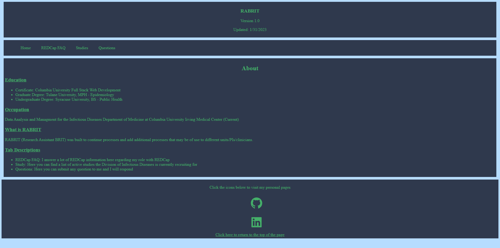
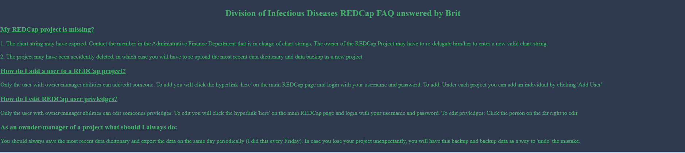
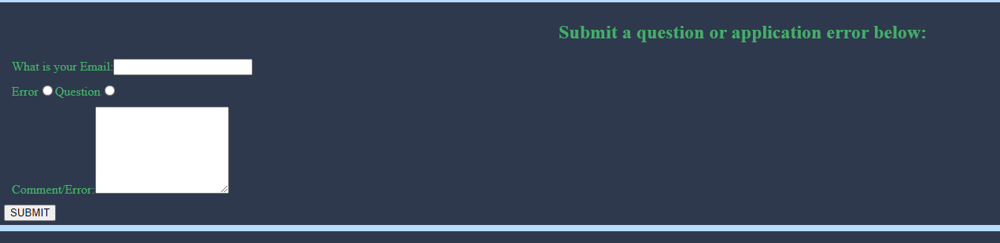

# RABRIT

## Project Description

Self designed application to automate and assist in clinical daily responsibilities.

I work with data analysis and data management in the Division of Infectious Diseases at Columbia University Irving Medical Center. This application will assist newer clinic members with questions. The application will also allow individuals to contact and submit requests for the RABRIT application.

## Tools Used

* Javascript
* HTML
* CSS
* React

## Future Developments

* Build a back end server that allows to collect data regarding submitted questions and errors regarding the application

* Build a tab for REDCap mock survey creation

* Build a tab for basic data analysis using an excel submit file

## Deployed Application

The deployed application can be found at:

https://rabrit.herokuapp.com/

## Screenshots

